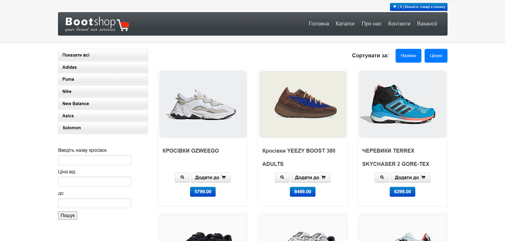
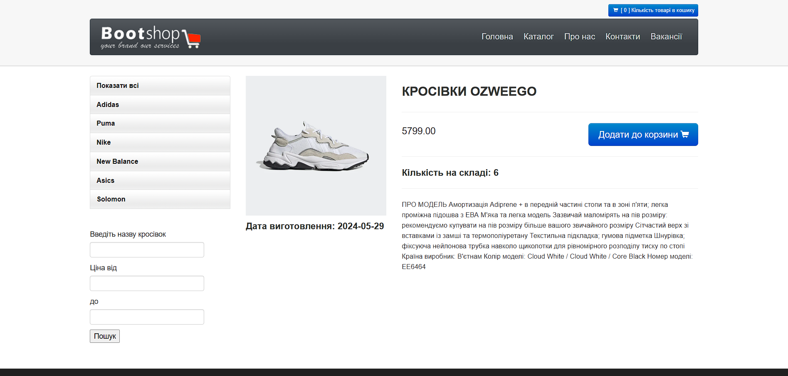
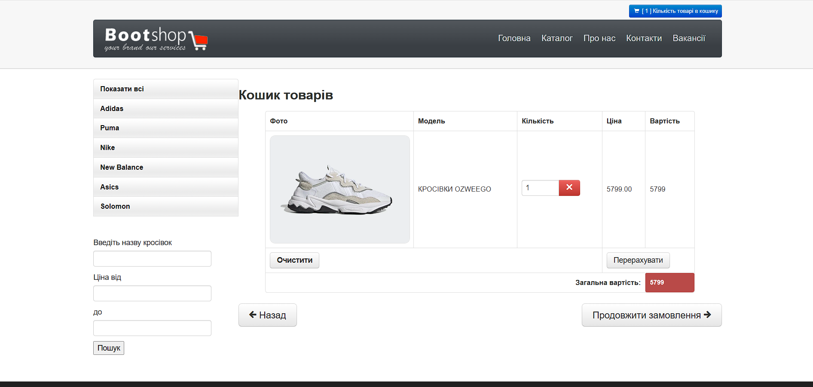
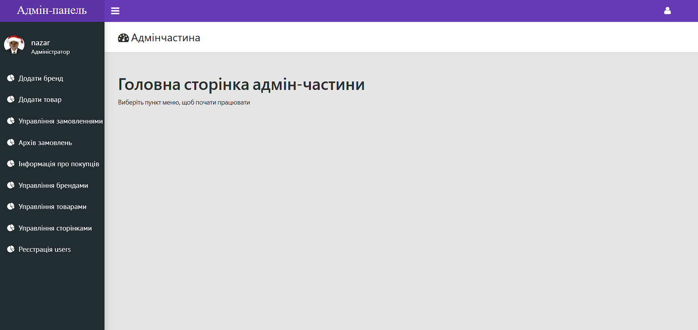
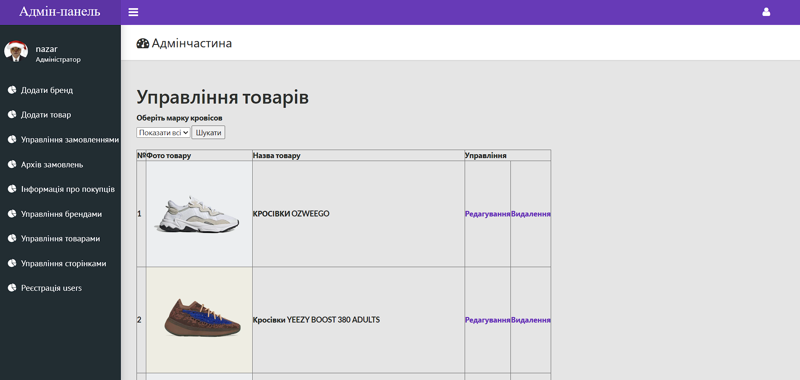

# SmartyShop  

## English Version  

**SmartyShop** – an online store developed using the **Smarty** templating engine.  

### About Smarty  

**Smarty** is a powerful PHP templating engine that separates application logic from presentation. It helps keep the code more structured and maintainable, allows easy design changes without affecting business logic, and improves both security and development convenience.  

## Features  
- Homepage  
- Product catalog  
- Product search  
- Shopping cart  
- Checkout process  
- Admin panel  
- Other basic e-commerce features  

## 🛠️ Technologies  
- PHP 5.6  
- MySQL  
- Smarty  
- HTML, CSS  

## ⚙️ Quick start  
1. Clone the repository to your server. 
2. Import the database from the file smartyShop.sql into your local MySQL database.
⚠️ After importing, it is recommended to delete the smartyShop.sql file from the project’s public folder.
3. Open the admin/param.php file and update the database connection details:
		- hostname – database server address
   	- username – your database username
   	- password – your database password
   	- dbname – database name
4. Start your server.

## 👤 User Roles
- **User**: browse catalog, use cart, place orders
- **Administrator**: manage products and orders via the admin panel
	- Login: `nazar`
	- Password: `1234`

---

## Українська версія

**SmartyShop** – це інтернет-магазин, розроблений з використанням шаблонізатора **Smarty**.  

### Про Smarty  

**Smarty** – це потужний PHP-шаблонізатор, який дозволяє відокремлювати логіку додатку від відображення. Використання Smarty робить код більш структурованим та підтримуваним, дозволяє легко змінювати дизайн без втручання в бізнес-логіку, а також покращує безпеку та зручність розробки.  

## Функціонал  
- Головна сторінка  
- Каталог товарів  
- Пошук товарів  
- Корзина  
- Оформлення замовлення  
- Адмін-панель
- Та інші базові можливості інтернет-магазину

## 🛠️ Технології  
- PHP 5.6
- MySQL  
- Smarty  
- HTML, CSS  

## Встановлення та запуск  
1. Клонуйте репозиторій на ваш сервер. 
2. Імпортуйте базу даних з файлу `smartyShop.sql` у вашу локальну MySQL базу.  
   ⚠️ Після імпорту рекомендується видалити файл `smartyShop.sql` з публічної папки проєкту.
3. Відкрити файл admin/param.php та замінити дані для підключення до бази даних:
   	- hostname – адреса сервера бази даних
   	- username – ваш логін до бази
   	- password – ваш пароль до бази
   	- dbname – назва бази даних
4. Запустіть ваш сервер.

## 👤 Ролі користувачів  
- **Користувач**: перегляд каталогу, корзина, оформлення замовлення  
- **Адміністратор**: керування товарами, замовленнями через адмін-панель  
  - Логін: `nazar`  
  - Пароль: `1234` 

## 📸 Скріншоти/Sreenshot

   
	<em>Каталог товарів/Product Catalog</em>

   
	<em>Детальніше/Product Details</em>

	 
	<em>Корзина/Shopping cart</em>

	 
	<em>Адмін-панель/Admin panel</em>

	 
	<em>Управління товарами/Product Management</em>

